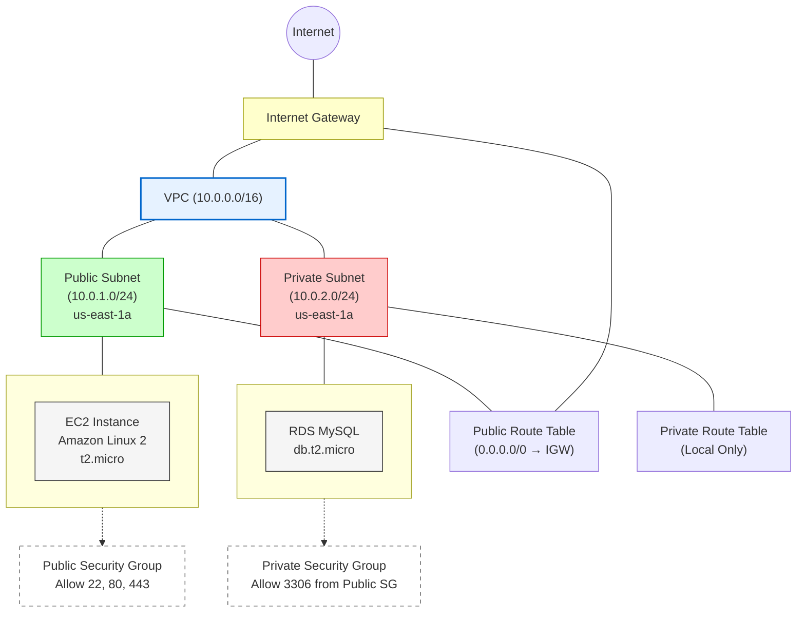

# AWS VPC Architecture Setup Guide

> [!info] About This Guide
> This step-by-step guide walks you through creating a secure AWS VPC architecture with public and private subnets. By following these instructions, you'll establish a production-ready network that follows AWS best practices for security and scalability.

## Introduction

This guide provides detailed instructions for setting up a Virtual Private Cloud (VPC) in Amazon Web Services (AWS). A VPC is a virtual network dedicated to your AWS account, providing logical isolation for your AWS resources while allowing secure connectivity. This architecture will include public and private subnets, route tables, internet gateway, EC2 instances, and an RDS MySQL database - following AWS best practices for security and scalability.

> [!tip] Learning Objectives
> By the end of this guide, you will understand how to:
> - Create and configure a custom VPC
> - Set up public and private subnets
> - Configure routing with Internet Gateway
> - Launch EC2 instances in public subnets
> - Deploy RDS databases in private subnets
> - Establish proper security groups
---

## Architecture Overview

> [!note] Visual Reference
> The diagram below shows the complete architecture we'll be building. Refer to it throughout the process to understand how components connect.



> [!tip] Understanding the Architecture
> - **Public subnet** resources can receive traffic directly from the internet
> - **Private subnet** resources are isolated from direct internet access
> - EC2 instances can connect to RDS databases across subnets using security groups

---
## Step-by-Step Implementation Guide

This guide walks through each step needed to create the architecture shown above. Check off items as you complete them.

### 1. Creating Your VPC Foundation

> [!important] Core Network Component
> The VPC is the foundation of your AWS network architecture. The 10.0.0.0/16 CIDR block provides up to 65,536 IP addresses for your resources.

- [ ] Sign in to the AWS Management Console
- [ ] Navigate to the VPC Dashboard
- [ ] Click "Create VPC"
- [ ] Configure the VPC with these exact settings:

```
Name tag: MyVPC
IPv4 CIDR block: 10.0.0.0/16
Tenancy: Default
```

- [ ] Click "Create VPC"

> [!note] Expected Result
> 
> Your VPC should appear in the VPC Dashboard with the status "available"
---

### 2. Creating Public and Private Subnets

> [!info] Subnet Design
> We'll create two subnets: a public subnet for internet-facing resources and a private subnet for protected resources like databases.

#### 2.1 Public Subnet Creation

- [ ] From the VPC Dashboard, select "Subnets" and click "Create subnet"
- [ ] Configure the public subnet with these settings:

```
Name tag: Public Subnet
VPC: MyVPC
Availability Zone: Select an AZ (e.g., us-east-1a)
IPv4 CIDR block: 10.0.1.0/24
```

- [ ] Click "Create subnet"

> [!tip] Public Subnets
> The public subnet will use a /24 CIDR block, providing 256 IP addresses (10.0.1.0 through 10.0.1.255)

#### 2.2 Private Subnet Creation

- [ ] Click "Create subnet" again
- [ ] Configure the private subnet with these settings:

```
Name tag: Private Subnet
VPC: MyVPC
Availability Zone: Select the same AZ as public subnet
IPv4 CIDR block: 10.0.2.0/24
```

- [ ] Click "Create subnet"

> [!note] Expected Result
> 
> You should now see both subnets listed in the Subnets dashboard with their respective CIDR blocks.
---

### 3. Setting Up Internet Connectivity

> [!important] Internet Access
> The Internet Gateway (IGW) is what allows resources in your public subnet to connect to the internet. Without this, nothing in your VPC can reach the outside world.

#### 3.1 Create an Internet Gateway

- [ ] From the VPC Dashboard, select "Internet Gateways" 
- [ ] Click "Create internet gateway"
- [ ] Configure the internet gateway:

```
Name tag: MyIGW
```

- [ ] Click "Create internet gateway"

#### 3.2 Attach Gateway to VPC

- [ ] Select the newly created internet gateway
- [ ] Click "Actions" > "Attach to VPC"
- [ ] Select "MyVPC" from the dropdown
- [ ] Click "Attach"

> [!note] Expected Result
> 
> The IGW state should change from "detached" to "attached"
---

### 4. Configuring Network Routing

> [!info] Traffic Control
> Route tables determine where network traffic is directed. We need different routing rules for public vs. private subnets.

#### 4.1 Public Route Table (Internet Access)

- [ ] From the VPC Dashboard, select "Route Tables"

### 5. Launch an EC2 Instance in Public Subnet

1. Navigate to the EC2 Dashboard
2. Click "Launch Instance"
3. Choose an Amazon Machine Image (AMI) (e.g., Amazon Linux 2)
4. Choose an instance type (e.g., t2.micro)
5. Configure instance details:
```
Network: MyVPC
Subnet: Public Subnet
Auto-assign Public IP: Enable
```
6. Add storage (default settings are fine)
7. Add tags:
```
Key: Name
Value: Public EC2 Instance
```
8. Configure security group:
```
Create a new security group
Name: Public Security Group
Allow SSH (port 22) from your IP
Allow HTTP (port 80) from anywhere
```
9. Review and launch
10. Create or select an existing key pair and launch the instance

### 6. Create an RDS MySQL Instance in Private Subnet

1. Navigate to the RDS Dashboard
2. Click "Create database"
3. Choose "Standard create"
4. Select "MySQL" as the engine type
5. Choose "Free tier" template (for learning purposes)
6. Configure database settings:
```
DB instance identifier: mydb
Master username: admin
Master password: [create a secure password]
```
7. Configure instance settings:
```
DB instance class: db.t2.micro
```
8. Configure storage (default settings are fine)
9. Configure connectivity:
```
Virtual Private Cloud (VPC): MyVPC
Subnet group: Create new DB Subnet group
Public access: No
VPC security group: Create new
    Name: Private Security Group
    Allow MySQL (port 3306) only from Public Security Group
```
10. Configure additional settings as needed
11. Click "Create database"

## Security Group Rules

### Public Security Group (for EC2)

| Type       | Protocol | Port Range | Source           | Description              |
|------------|----------|------------|------------------|--------------------------|
| SSH        | TCP      | 22         | Your IP Address  | Allow SSH from your IP   |
| HTTP       | TCP      | 80         | 0.0.0.0/0        | Allow HTTP from anywhere |
| HTTPS      | TCP      | 443        | 0.0.0.0/0        | Allow HTTPS from anywhere|

### Private Security Group (for RDS)

| Type       | Protocol | Port Range | Source                | Description                 |
|------------|----------|------------|-----------------------|-----------------------------|
| MySQL      | TCP      | 3306       | Public Security Group | Allow MySQL from Public EC2 |

## Testing the Connection

To test connectivity from your EC2 instance to the RDS database:

1. SSH into your EC2 instance:
```bash
ssh -i /path/to/your-key.pem ec2-user@[EC2-Public-IP]
```

2. Install the MySQL client:
```bash
sudo yum install mysql -y
```

3. Connect to your RDS instance:
```bash
mysql -h [RDS-Endpoint] -u admin -p
```

4. When prompted, enter your database password

## Tips and Best Practices

- **Security**: Always follow the principle of least privilege when configuring security groups
- **Cost Management**: Remember to terminate resources when not in use to avoid unnecessary charges
- **High Availability**: For production environments, deploy resources across multiple Availability Zones
- **Backups**: Enable automated backups for your RDS instance
- **Encryption**: Consider enabling encryption for sensitive data in your RDS instance
- **Monitoring**: Set up CloudWatch alerts to monitor the health and performance of your resources
- **NAT Gateway**: For production environments, consider adding a NAT Gateway to allow instances in private subnets to access the internet

## Cleanup

When you're done with this exercise, remember to delete all resources to avoid incurring charges:

1. Delete the RDS instance
2. Terminate the EC2 instance
3. Delete security groups
4. Detach and delete the Internet Gateway
5. Delete subnets
6. Delete route tables
7. Delete the VPC

